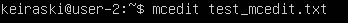
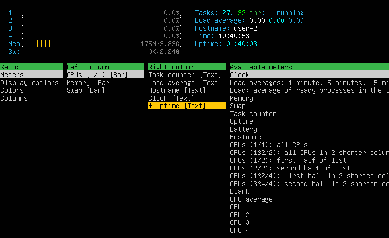
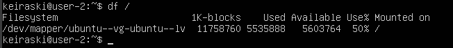

## Contents

 - [**Part 1.** Установка ОС](#part-1-установка-ос)
 - [**Part 2.** Создание пользователя](#part-2-создание-пользователя)
 - [**Part 3.** Настройка сети ОС](#part-3-настройка-сети-ос)  
 - [**Part 4.** Обновление ОС](#part-4-обновление-ос)
 - [**Part 5.** Использование команды  sudo](#part-5-использование-команды-sudo)
 - [**Part 6.** Установка и настройка службы времени](#part-6-установка-и-настройка-службы-времени)
 - [**Part 7.** Установка и использование текстовых редакторов](#part-7-установка-и-использование-текстовых-редакторов)
 - [**Part 8.** Установка и базовая настройка сервиса SSHD](#part-8-установка-и-базовая-настройка-сервиса-sshd)
 - [**Part 9.** Установка и использование утилит top, htop](#part-9-установка-и-использование-утилит-top-htop)
 - [**Part 10.** Использование утилиты fdisk](#part-10-использование-утилиты-fdisk)
 - [**Part 11.** Использование утилиты df](#part-11-использование-утилиты-df)
 - [**Part 12.** Использование утилиты du](#part-12-использование-утилиты-du)
 - [**Part 13.** Установка и использование утилиты ncdu](#part-13-установка-и-использование-утилиты-ncdu)
 - [**Part 14.** Работа с системными журналами](#part-14-работа-с-системными-журналами)
 - [**Part 15.** Использование планировщика заданий CRON](#part-15-использование-планировщика-заданий-cron)

## Part 1. Установка ОС 

- Выполним команду `cat /etc/issue` чтобы узнать версию Ubuntu  
\
  

  > ***/etc*** - папка содержащая конфигурационные файлы настройки ОС и некоторых программ.  
  > ***/etc/issue***(*eng. версия*) - файл содержащий информацию о версии ОС

## Part 2. Создание пользователя 

- Создадим нового пользователя и добавим его в группу ***adm*** при помощи команды `sudo useradd -G adm [username]`  

- Убедимся что новый пользователь был создан выполнив команду `cat /etc/passwd`  

  > ***-G*** (*groups*)  - наименование групп в которые следует добавить пользователя  

## Part 3. Настройка сети ОС 

### 3.1. Задать название машины
- Для задания имени компьютера воспользуемся командой `hostnamectl set-hostname [hostname]`  

### 3.2. Установить временную зону, соответствующую текущему местоположению
- Для работы с временной зоной воспользуемся утилитой `timedatectl`

- Для смены часового пояса выполним команду `timedatectl set-timezone [timezonename]`  
  

### 3.3. Вывести названия сетевых интерфейсов
- **Сетевой интерфейс** - это точка соединения хоста (компьютера) с сетью (LAN/WAN), например сетевая карта, модем или Wi-Fi модуль.

- Для просмотра параметров и конфигурирования сетевых интерфейсов, существует встроенная утилита **ip**.  
Чтобы просмотреть список доступных интерфейсов выполним команду `ip -br l`  

- Рассмотрим список представленных интерфейсов подробнее:  
  > **lo** (*loopback device*) - виртуальный интерфейс, присутствующий по умолчанию в любом Linux. Его используют для подключения приложений и процессов на одном компьютере к другим приложениям и процессам, а так же для отладки сетевых программ и запуска серверных приложений на локальной машине.  
  > **enp0s3** - сетевой интерфейс/сетевая карта

### 3.4. Используя консольную команду, получить ip адрес устройства от DHCP сервера

- Для работы в сети (LAN/WAN) устройству необходим IP-адрес, присваиваемый каждому сетевому интерфейсу устройства. Просмотреть присвоенные IP-адреса можно с помощью команды `ip -br a`  
  
  > ***-br*** (*brief*) - сокращенный вывод  
  > ***a*** (*address*) - сетевые адреса

- **DHCP (*Dynamic Host Configuration Protocol*)** - протокол динамического конфигурирования хостов, автоматизирует процесс конфигурирования сетевых интерфейсов, гарантируя от дублирования адресов за счёт централизованного управления их распределением. Применяется для настройки больших сетей, в которых назначать IP-адреса вручную может быть неудобно. 

- Запросим у DHCP-сервера новый IP-адрес для сетевого интерфеса **enp0s3** при помощи команды `dhclient -v [network device name]`  

  > ***-v***(*verbosity*) - включить подробный вывод из журнала сообщений

### 3.5. Определить и вывести на экран внешний и внутренний ip-адреса шлюза
- **Сетевой шлюз (*Gatewey*)** - устройство или программное обеспечение для сопряжения компьютерных сетей.  
Шлюз имеет два IP-адреса: внешний, идентифицирующий его во внешней сети и внутренний, для локальной сети.

- Для просмотра внутреннего адреса воспользуемся командой `ip r`  

  > ***r*** (*route*) - таблица маршрутизации  

- **IP-адрес по умолчанию** (*default*) - `10.0.2.2`, является внутренним адресом шлюза.

- Внешний IP-адрес можно увидеть в настройках маршрутизатора, служащего шлюзом для выхода во внешние сети (бывает затруднительно ввиду отсутствия доступа), либо при помощи сторонних ресурсов. В качастве такого ресурса воспользуемся сайтом **eth0.me**.

- Введем команду `wget -q -O - eth0.me`  

### 3.6. Задать статичные настройки ip, gw, dns
**DNS (*Domain Name System*)** - система доменных имен, это сетевая служба автоматически устанавливающая соответствие между доменными именами и IP-адресами на основании создаваемых таблиц соответствия.

- Узнать какой DNS-сервер используется системой можно с помощью команды `sudo resolvectl`  

- В Linux есть несколько способов заменить динамические адреса, на стаические в зависимости от вида Linux-системы, её версии, а так же хотим ли мы внести временные изменения, либо постоянные.

- Для постоянных изменений нужно внести правки в конфигурационные файлы приложения, отвечеающего за настройку сети. В нашем случае таким приложением служит **Netplan**, а его конфигурационные файлы находятся по адресу **/etc/netplan** и имеют формат **[filename].yaml**.  
Посмотрим какая информация в них хранится:

  > **network** - начало описания настроек сети;  
  > **ethernets** - тип описываемого соединения - проводной;  
  > **enp0s3** - описываемый сетевой интерфейс;  
  > **dhcp4** - DHCP-сервер для адресов 4й версии (*IPv4*)
  > **version** - версия языка YAML на котором происходит описание;  

- Для сетевого интерфейса хоста нет никаких настроек кроме подключенного DHCP-сервера, исправим это:  

Мы отключили DHCP-сервера 4й и 6й версий, прописали статичный IP-адрес для сетевого интерфейса (*10.0.2.20/24*), указали адрес шлюза по умолчанию и IP-адрес DNS-сервера (*8.8.8.8*).

- Чтобы применить данные настройки выполним команду `sudo netplan apply`

### 3.7. Перезагрузить виртуальную машину. Убедиться, что сетевые настройки статичны

- Для перезагрузки системы можно выполнить команду `reboot`
- Проверим внесенные нами настройки после перезагрузки:  

Сетевой интерфейс **enp0s3** имеет заданный адрес *10.0.2.20/24* вместо выдаваемого DHCP-сервером по умолчанию адреса *10.0.2.15/24*.  

В строке описывающей шлюз по умолчанию **default** видим надпись *proto static*, подтверждающую что он задан статически.  

используется заданный DNS-сервер с адресом *8.8.8.8*.

- Чтобы удостовериться, что заданные настройки сохранились после перезагрузки, пропингуем удаленные хосты:

Передача пакетов прошла без потерь (*0% packet loss*), а значить настройки сетевого интерфейса и шлюза по умолчанию функционируют корректно.  
 

Передача пакетов с ипользованием доменного имени вместо IP-адреса так же выполняется корректно, а значит заданный нами DNS-сервер так же работоспособен.

## Part 4. Обновление ОС 

- **apt (*Advanced Packaging Tool*)** -  программа для установки, обновления и удаления программных пакетов в операционной системе Debian и основанных на ней (Ubuntu, Mint и т. п.).

Чтобы обновить локальный индекс пакетов последними изменениями внесенными в репозитории, воспользуемся командой `sudo apt update`  

- Непосредственное обновление может быть выполнено командой: `sudo apt upgrade` 

- Чтобы убедиться в успешности обновления ещё раз выполним команду `sudo apt update`  

## Part 5. Использование команды **sudo** 

- **Linux** многопользавтельская система, все действия в ней совершаются от лица определенного пользователя наделенного определенными правами.  
Изначально в системе имеется один суперпользователь (***root***), обладающий неограниченными правами. Остальным пользователям, для внесения системнозначимых изменений, необходимо было переключаться на root-пользователя путём перелогина или запуском рабочей оболочки суперпользователя при промощи команды **su** (*Switch User*).
  > В настоящее время в Ubuntu root аккаунт по умолчанию отключён.

- **sudo (Substitute User and DO - подменить пользователя и выполнить*)** - утилита позволяющая выполнять действия от имени другой учётной записи, по умолчанию это суперпользователь (*root*). Файл **/etc/sudoers** хранит настройки утилиты для конкретных пользователей и групп, определяя какие именно действия они могут совершать от имени суперпользователя.

- Для того чтобы разрешить пользователю выполнять **команду sudo**, нужно добавить его в **группу "sudo"** командой `sudo usermod -a -G sudo [username]`  
  

- Убедимся что пользватель был добавле, просмотрев группы в которые он включён командой `groups [username]`  

- Изменим имя хоста от имени созданного нами пользователя, используя команду **sudo**: `sudo -u [username] hostnamectl set-hostname user-2`
  

- Убедимся что у нас всё получилось просмотрев содержимое соответсвующего файла командой `cat /etc/hostname`  

## Part 6. Установка и настройка службы времени 

### 6.1. Вывести время часового пояса, в котором сейчас находишься.

- Самый простой способ вывести время в Linux - воспользоваться командой `date`  

По умолчанию, программа показывает день недели, дату, время и часовой пояс.

### 6.2. Вывод команды `timedatectl show` должен содержать "NTPSynchronized=yes"

**NTP (*Network Time Protocol*)** - протокол сетевого времени, NTP-сервер считывает фактическое время с эталонных часов и распространяет эту информацию по сети. За взаимодействие с такими серверами на хосте отвечает **служба времени**.

- **Служба времени** - специальная утилита в дистрибутивах Linux, отвечающая за синхронизацию даты и времени.  

В настоящее время Ubuntu по умолчанию использует службу времени **timesyncd**, интегрированую с **systemd** и запускает её автоматически после установки.

- Выполним команду `timedatectl show`  

## Part 7. Установка и использование текстовых редакторов 

### 7.1. Установить текстовые редакторы VIM + любые два по желанию

- Установим необходимые утилиты при помощи команды `sudo apt install [filename]`  

### 7.2. Создать/отредактировать/сохранить файл
- ***Создание файла***  
Для любого из трёх редакторов достаточно выполнить команду вида `[name_of_program] [filename]`  
  

- ***Сохранение файла***
  - **vim**  
  Выйти из режима ввода текта нажав клавишу **"Esc"** (надпись "ВСТАВКА" в левом нижнем углу исчезнет)  
  Войти в командный режим набрав комбинацию **"Shift + :"**  
  Ввести букву **"w"**

  

  Нажать клавишу **"Enter"**

  - **nano**  
  Набрать комбинацию клавиш **"Ctrl + O"**  
  Редактор предложит подтвердить имя файла для сохранения  
  

  Нажать клавишу **"Enter"**  
  Редактор подтвердит успешность записи в файл соответсвующей надписью внизу экрана  
  
  - **mcedit**  
  Нажать клавишу **"F2"**  
  Редактор попросит подтвердить сохранение в окне, в центре экрана  
  

  Пункт **"Сохранить"** предварительно выбран, поэтому достаточно просто нажать **"Enter"**

### 7.3. Выйти без сохранения

- Для всех трёх редакторов открываем нужный файл той же командой, что и при создании.
- Редактируем текст

- Для выхода без сохранения:  
  - **vim**  
  -Выйти из режима редактирования нажав клавишу **"Esc"**  
  -Войти в командный режим набрав комбинацию **"Shift + :"**  
  -Ввести комбинацию **"q!"** и нажать **"Enter"**  
  
  
  - **nano**  
  -Нажать комбинацию клавиш **"Ctrl + X"** соответствующую команде **выход**  
  -Редактор уточнит необходимость сохранения изменений внизу экрана  
  -Нажать клавишу **"N"**  
  

  - **mcedit**  
  -Нажать клавишу **"F10"** соответствующую команде **выход**  
  -Редактор уточнит необходимость сохранения изменений в специальном окно в центре экрана  
  -Выбрать пункт **"Нет"** и нажать клавишу **"Enter"**  
   

### 7.4. Поиск по тексту и замена

- **vim**  
Чтобы найти слово, находясь в командном режиме набрать команду:  
`/[искомое слово]`  
 

Для замены слова, находясь в командном режиме набрать команду:  
`:s/[заменяемое слово]/[слово на замену]`  
 
 

- **nano**  
Для поиска набрать комбинацию клавиш **"Ctrl + W"**  
В появившейся внизу экрана строке поиска набрать искомое слово  
 
 

Для замены набрать комбинацию клавиш **"Ctrl + \\"**  
В появившейся внизу экрана строке поиска набрать искомое слово  
 

После нажатия клавиши **"Enter"** редактор предложит ввести слово, на которое будет осуществлена замена  
 

После нажатия клавиши **"Enter"** редактор уточнит какое именно вхождение искомого слова нужно заменить  
 
 

- **mcedit**  
Поиск осуществляется при помощи клавиши **"F7"**  
В появившемся после её нажатия окне следует ввести искомое слово

Замену можно выполнить нажатием клавиши **"F4"**  
В появившемся окне вводится искомое слово и слово на которое его нужно заменить  

Далее редактор предложит выбрать какое именно вхождение введённого слова нужно заменить  
 

После нажатия соответствующей клавиши слово будет заменено  

## Part 8. Установка и базовая настройка сервиса **SSHD** 

> **SSH (*Secure Shell - безопасная оболочка*)** - сетевой протокол прикладного уровня, позволяющий производить удалённое управление хостом через защищенное шифрованием соединени.  

### 8.1. Установка службы SSHd

- Существует множество программ SSH-серверов для Linux, самой распространённой и задающей стандарты в данном направлении является **openssh-server** - её и будем использовать.

- Установим необходимые утилиты при помощи команды `sudo apt install openssh-server`  
  

- Чтобы удостовериться что установка состоялась введём `ssh -V`  

### 8.2. Автостарт службы при загрузке

- **SSHd** - это демон, программа запускающаяся в фоновом режиме и ожидающая запроса на соединение от **SSH-клиента**.  
Статус **SSHd** можно узнать при помощи команды `systectl status sshd`  
   

- **SSHd** активировался автоматически при установке **openssh-server**

### 8.3. Команда **ps** с ключами для демонстрации процесса sshd

- **ps (*process status*)** - программа выводящая отчёт о работающих процессах. По умолчанию выводит в терминал список всех запущенных процессов кроме фоновых  
- Чтобы увидеть все процессы, включая фоновые, используем флаг **"-A"**, и найдём среди них процесс принадлежащий **SSHd** с помощью утилиты **grep**  

### 8.4. Настройка порта

- По умолчанию, в ожидании запроса на подключение, **SSHd** слушает порт 22.
- Для настройки **SSHd** нужно отредактировать конфигурационный файл **/etc/ssh/sshd_config**

- По умолчанию настройки порта закомментированы и неактивны  
- Раскомментируем их и внесём правку  

- Для того чтобы изменения вступили в силу нужно перезапустить службу **SSHd** командой systemctl restart sshd`  

### 8.5. Служба **netstat**

- **netstat (*network statistics*)** — утилита предназначенная для получения сведений о состоянии сетевых соединений и статистических данных по сетевым интерфейсам и протоколам.

- **netstat** имеет формат `netstat [option] [<Socket>]` и по умолчанию выводит в терминал перечень всех сокетов активных в данный момент  

- У нас есть возможность выбрать, информацию по каким именно сокетам мы хотим получить  
- В частности флаг **"-t" / "--tcp"** выведет на экран только сокеты работающие по протоколу **TCP**  
- Но никаких соединений не видно, т.к. по умолчанию **netstat** выводит перечень только активных соединений, чтобы это исправить воспользуемся флагом **"-a" / "--all"** 
 

- Одно из соединений имеет буквенное наименование **"localhost:domain"**, чтобы вместо имени увидеть IP-адрес данного хоста, добавим флаг **"-n" / "--numeric"**  
 

  - **Proto** - протокол используемый сокетом (tcp/udp/raw);  
  - **Recv-Q** - счётчик байт не скопированных программой пользователя из этого сокета;  
  - **Send-Q** - счётчик байт, не подтверждённых удалённым узлом; 
  - **Locale Address** - адрес и номер порта локального конца сокета;  
  - **Foreign Address** - адрес и номер порта удалённого конца сокета;  
  - **State** - состояние сокета (LISTEN/ESTABLISHED/CLOSE)

## Part 9. Установка и использование утилит **top**, **htop**
### 9.1. Утилита **top**

- **top (*table of processes*)** — консольная команда, которая выводит список работающих в системе процессов и информацию о них.  
**htop** выполняет те же функции что и **top**, но обладает рядом дополнительных возможностей.

- Вывод команды `top`  

Интерфейс можно разделить на две рабочие зоны:  
  - **Верхняя рабочая зона** - содержит сведения о времени работы сервера, свободных и занятых ресурсах, пользователях;
  - **Основная рабочая зона** - это динамически обновляемая таблица, содержащая сведения о процессах.  

- **top** - верхняя строчка содержит общую информацию, в том числе точное время  
  
- **Tasks** - строка процессов, отображает статистику процессов, выполняемых операционной системой  

- **%Cpu(s)** - строка информации о процессорах, показывает процент процессорного времени, затраченного на различные задачи.   

- Последние 2 строки показывают информацию об использовании памяти в системе. **Mem** - оперативной памяти, а **Swap** - области подкачки.  

**PID (*Process Identifier*)** - идентификационный номер процесса;  
**USER (*Username*)** - имя пользователя, от имени которого был запущен процесс;  
**PR (*Priority*)** - приоритет процесса;  
**NI (*Nice*)** - приоритет процесса, выставленный командой `nice`;  
**VIRT (*Virtual*)** - полный объем виртуальной памяти занимаемой процессом;  
**RES (*Resident Size*)** - объем оперативной памяти занимаемой процессом;  
**SHR (*Shared Size*)** - объем разделяемой памяти занимаемой процессом;  
**S (*State*)** - состояние процесса ("R *(running)*" - в работе, "S *(sleeping)*" - спящий, "I *(Idle)*" - бездействующий поток ядра, и тд);  
**%CPU** - использование CPU в процентах;  
**%MEM** - использование RAM в процентах;  
**TIME+** - время использования CPU в секундах;
**COMMAND** - команда, запустившая процесс.  

- Как и большинство программ, **top** имеет ряд дополнительных опций которые могут быть активированы при выполнении команды.
-При помощи клавиш **"<"** и **">"** мы можем выбирать столбец в **Основной рабочей зоне**, по которому будут осортированы выводимые процессы, а нажатие клавиши **"x"** включает/выключает подсветку столбца, по которому производится сортировка.  

- По умолчанию **top** сортирует процессы по столбцу **%CPU**  

- Отсортируем процессы по использованию ими памяти:  

- Таким образом:
  - uptime - **1:12**;  
  - количество авторизованных пользователей - **1**;  
  - общую загрузку системы - **0,00**;  
  - общее количество процессов - **120**;  
  - загрузку cpu - **0,0**;  
  - загрузку памяти - **779**;  
  - pid процесса занимающего больше всего памяти - **719**;  
  - pid процесса, занимающего больше всего процессорного времени - **1722**.  

### 9.2. Утилита **htop**

- Утилита **htop** имеет схожую структуру организации рабочего пространства.  

- Добавим в **Верхнюю рабочую зону** вывод **hostname** и **clock**, **uptime**

- Как и в **top** есть возможность сортировки вывода процессов:  

- по **CPU%** нажатием клавиши **"P"**  

- по **MEM%** нажатием клавиши **"M"**  

- по **TIME+** нажатием клавиши **"T"**  

- Также можно воспользоватся меню сортировки нажатием клавиши **"F6"**  
Например для сортировки по **PID**  

- Полезной способностью **htop** является фильтр процессов, достаточно нажать **"F4"** и ввести в появившемся поле ключевое слово.   

- Так же есть возможность прямого поиска по процессам. Нажмём **"F3"** и введём название искомого процесса.  

## Part 10. Использование утилиты **fdisk**

- **fdisk (*format disk*)** - системная утилита для управления разделами жёсткого диска в интерфейсе командной строки.  

- **"-l" (*list*)** - наиболее часто используемая опция программы **fdisk**, позволяющая просмотреть полный перечень доступных дисков и их разделов. Выполним команду `sudo fdisk -l`.  
  

- Мы видим что в системе присутствует диск **sda** размером 7ГиБ, разбитый на 52 428 800 секторов, по 512 байт каждый.  
Размер файла-подкачки (*swap*) - 2.2Gi.  

 

## Part 11. Использование утилиты **df** 

- **df (*disk free*)** - утилита показывающая список всех файловых систем по именам устройств, сообщает их размер, занятое/свободное пространство и точки монтирования.  

- Выполним команду `df` для корневого раздела ( **/** ):  

К корневому каталогу примонтирована система **ubuntu--vg-ubuntu--lv**, общим размером **11 758 760** блоков, из которых **5 535 888** ( **50%** ) использовано, а **5 603 764** свободно.

- По умолчанию утилита **df** выводит размеры в кибибайтах (1К-блоках), существуют дополнительные опции облегчающие восприятие размеров:  

  - **"-h" (*human-readable*)** - вывод в человеко-читаемом формате  

  - **"-H"** - вывод в человеко-читаемом формате, в единицах СИ (Килобайты, Мегабайты, Гигабайты...)  
  

  - **"-T" (*print-type*)** - дополнительно выводит в консоль тип для каждой файловой системы.  
  

  Тип файловой системы, на которой находится наш корневой каталог **ext4**.
    > **ext4 (*fourth extended file system*)** - журналируемая файловая система.

## Part 12. Использование утилиты **du** 

- **du (*disk usage*)** - программа для оценки занимаемого файлового пространства.
Запущенная без аргументов, команда **du** выдает отчёт о занимаемом дисковом пространстве для текущего каталога, каталогов находящихся в нём и всех их подкатологов всех уровней.  
  

В качестве аргумента можно указать конкретный каталог, команда `du /home` выведет размер папки */home*, и всех каталогов/подкаталогов содержащихся в ней
  

- Отформатировать выводимые данные можно при помощи опции **"-s" (*summarize*)** выдающей суммарный итог только для заданного аргумента.  
- По умолчанию, размеры указываются в блоках по 1024 байта (1 Кибибайт). Уже знакомая нам опция **"-h" (*human-readable*)** добавляет в вывод команды букву размера, делая его более читаемым.  
- **"-b" (*bytes*)** - опция демонстрирующая размер в байтах.  
 

- В качестве аргументов можно указать сразу несколько не зависящих друг от друга директорий.  

 

- Для отображения не только каталогов, но и файлов, входящих в указанную директорию можно можно воспользоваться командой `du /var/log/*`  
  

## Part 13. Установка и использование утилиты **ncdu**   
### 13.1. Установка **ncdu**

- Установим программу **ncdu** с помощью команды `sudo apt install ncdu`
- Убедимся в корректности установки запросив версию программы **ncdu** командой `ncdu -v`  

### 13.2. Знакомство с **ncdu**

- **ncdu (*NCurses Disk Usage*)** - программа для оценки дискового пространства, в отличии от **du** позволяет анализировать ситуацию в интерактивном режиме.  

- При запуске без аргументов **ncdu** демонстрирует содержимое каталога из которого был выполнен запуск, а так же позволяет заходить в каталоги данной директории.  

- Перемещение при помощи стрелок вверх/вниз, стрелка вправо чтобы зайти в папку, стрелка влево чтобы выйти.  

### 13.3. Сравнение с **du**

- В прошлой главе мы просмотрели размеры нескольких папок с использованием команды **du**:  

- Выполним команду `ncdu /` открыв корневой каталог:  
- Для большей наглядности воспользуемся клавишей **"i"**, дающей более подробную информацию об объекте:  

для каталога /var  

- В выводе **du** размер папки **/var** отличается от вывода **ncdu**, потому что она не учитывает папку **/var/log** входящую в **/var**.

для каталога /home  
  

и для каталога /var/log  

## Part 14. Работа с системными журналами 

- Приложения и системные программы заносят служебную информацию об основных событиях в специальные журналы (так называемые лог-файлы). Основное место хранения подобных журналов - каталог /var/log.  

- **syslog - system log**, глобальный системный журнал, содержит сообщения от различных системных служб и обеспечивает централизованную регистрацию событий и действий различных компонентов системы.  

Рассмотрим первые 10 строк **syslog** при помощи команды `head /var/log/syslog`  

- **dmesg - diagnostic message**, хранит сообщения ядра и драйверов всех устройств хоста об обнаружении оборудования, инициализации устройств и других событиях при загрузке системы.  
Журнал представляет из себя обычный текстовый файл, который можно просмотреть множеством способов, однако есть и специальная команда `dmesg`, для работы с его содержимым.  

- **auth.log**, в этот файл записываются события, связанные с аутентификацией, такие как вход пользователей в систему, сбои аутентификации и попытки доступа пользователей.  
Просмотрим журнал **auth.log** при помощи команды `less /var/log/auth.log`  
  

Найдём последнюю успешную авторизацию в системе

В ней мы видим:  
1 Дату и время регистрации сообщения - "May 12 09:02:52"
2 Имя компьютера, с которого пришло сообщение - "user-2"
3 Имя программы или службы, к которой относится сообщение - "login"
4 Идентификатор процесса, отправившего сообщение - [750]
5 Текст сообщения - "session opened for user neomamoo by LOGIN"
 
  Таким образом, последний успешный вход в систему был осуществлён в **09:02**, под именем пользователя **shermanc**, по логину (**by LOGIN**).

- Попробуем перезапустить службу **SSHd** и найти в логах сообщения об этом.  
Перезапустим службу командой `systemctl restart sshd`  

Заглянем в файл **syslog** 
  
Последние пять сообщений информируют нас об усспешной остановке и запуске **SSHd (*Secure Shell server*)**  

## Part 15. Использование планировщика заданий **CRON** 

- **CRON** - это планировщик заданий, который можно использовать для автоматического выполнения повторяющихся задач, указав команду и расписание её выполнения. 

Чтобы создать новое задание для **CRON** введём команду `crontab -e` - программа откроет файл-расписание пользователя (под которым мы работаем) в текстовом редакторе.  

В системном журнале **/var/log/syslog** мы видим, что каждые 2 минуты **CRON** вносит в журнал записи.
  

- Удалим все задания из планировщика заданий при помощи команды `crontab -r` и попробуем вновь вызвать список всех задач командой `crontab -l`  
  
