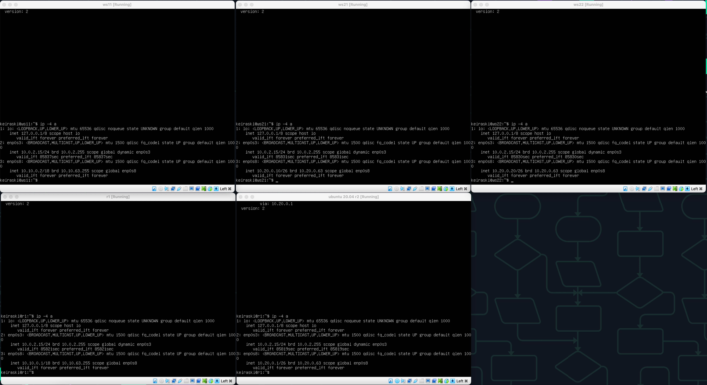
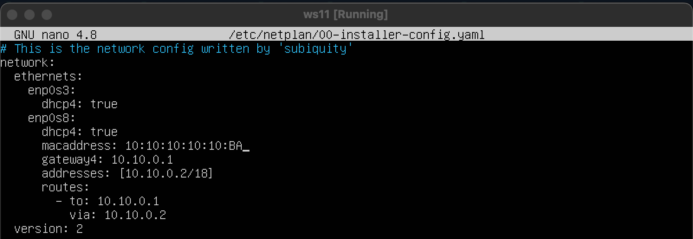

## Part 1. Инструмент **ipcalc**

#### 1.1. Сети и маски

`sudo apt install ipcalc` для установки ipcalc
- Определи и запиши в отчёт:
1) Адрес сети *192.167.38.54/13* = 192.167.38.54

\
Адрес сети : 192.160.0.0/13

2) Перевод маски *255.255.255.0* в префиксную и двоичную запись

/24\
11111111.11111111.11111111.00000000

\
Маска в префиксной записи и двоичной

*/15* в обычную и двоичную

255.254.0.0
11111111.11111110.00000000.00000000

\
*/15* в обычной и двоичной 

*11111111.11111111.11111111.11110000* в обычную и префиксную

255.255.255.240\
/28

\
11111111.11111111.11111111.11110000 в обычной и префиксной

3) Минимальный и максимальный хост в сети 12.167.38.4 при масках: /8, 11111111.11111111.00000000.00000000, 255.255.254.0 и /4<br> 

    - ```На скрине минимальные и максимальные хосты по заданным маскам ```
<br>

#### 1.2. localhost

##### Определи и запиши в отчёт, можно ли обратиться к приложению, работающему на localhost, со следующими IP: *194.34.23.100*, *127.0.0.2*, *127.1.0.1*, *128.0.0.1*

По адрессам 194.34.23.100 и 128.0.0.1 обатится не возможно т.к. у них нет петли

А по адрессам 127.0.0.2 и 127.1.0.1 обатится возможно т.к. есть loopback

- 194.34.23.100 - нет
- 127.0.0.2 - да
- 127.1.0.1 - да
- 128.0.0.1 - нет

#### 1.3. Диапазоны и сегменты сетей

##### Определи и запиши в отчёт:

1. какие из перечисленных IP можно использовать в качестве публичного, а какие только в качестве частных: <br>
    - 10.0.0.45 - частный
    - 134.43.0.2 - публичный
    - 192.168.4.2 - частный
    - 172.20.250.4 - частный
    - 172.0.2.1 - публичный
    - 192.172.0.1 - публичный
    - 172.68.0.2 - публичный
    - 172.16.255.255 - частный
    - 10.10.10.10 - частный
    - 192.169.168.1 - публичный


2. какие из перечисленных IP адресов шлюза возможны у сети 10.10.0.0/18: <br>
    - 10.0.0.1
    - 10.10.0.2 - возможен
    - 10.10.10.10 - возможен
    - 10.10.100.1
    - 10.10.1.255 - возможен

## Part 2. Статическая маршрутизация между двумя машинами


##### С помощью команды `ip a` смотрим существующие сетевые интерфейсы на двух машинах.


##### Описываем сетевой интерфейс, соответствующий внутренней сети, на обеих машинах и задаем следующие адреса и маски: ws1 - *192.168.100.10*, маска */16*, ws2 - *172.24.116.8*, маска */12*.

Команда `sudo nano /etc/netplan/00-installer-config.yaml`


##### Выполнили команду `netplan apply` для перезапуска сервиса сети.

#### 2.1. Добавление статического маршрута вручную

##### Добавь статический маршрут от одной машины до другой и обратно при помощи команды вида `ip r add`.

Добавил route с обеих машин\
ws1 `sudo ip r add 172.24.116.8 via 192.168.100.10 dev enp0s8`\
ws2 `sudo ip r add 192.168.100.10 via 172.24.116.8 dev enp0s8`


\
Внесение изменений


\
Применил изменения и пропинговал машины

#### 2.2. Добавление статического маршрута с сохранением
##### Перезапусти машины.
##### Добавь статический маршрут от одной машины до другой с помощью файла *etc/netplan/00-installer-config.yaml*.

Добавляем статические натсройки пути в конфиг `sudo nano /etc/netplan/00-installer-config.yaml`

\
Статические настройки пути


Пропинговал машины

## Part 3. Утилита **iperf3**

#### 3.1. Скорость соединения
##### Переведи и запиши в отчёт: 8 Mbps в MB/s, 100 MB/s в Kbps, 1 Gbps в Mbps.

8 Mbps = 1 MB/s.\
100 MB/s = 800000 Kbps.\
1 Gbps =  1000 Mbps.

#### 3.2. Утилита **iperf3**
##### Измерь скорость соединения между ws1 и ws2.

`sudo apt install iperf3`

\
Команда iperf3

## Part 4. Сетевой экран

#### 4.1. Утилита **iptables**
##### Создай файл */etc/firewall.sh*, имитирующий фаерволл, на ws1 и ws2:

`sudo touch /etc/firewall.sh`

##### Нужно добавить в файл подряд следующие правила:
##### 1) На ws1 примени стратегию, когда в начале пишется запрещающее правило, а в конце пишется разрешающее правило (это касается пунктов 4 и 5).
##### 2) На ws2 примени стратегию, когда в начале пишется разрешающее правило, а в конце пишется запрещающее правило (это касается пунктов 4 и 5).
##### 3) Открой на машинах доступ для порта 22 (ssh) и порта 80 (http).
##### 4) Запрети *echo reply* (машина не должна «пинговаться», т.е. должна быть блокировка на OUTPUT).
##### 5) Разреши *echo reply* (машина должна «пинговаться»).

\
Содержание файлов firewall на каждой машине

##### Запусти файлы на обеих машинах командами `chmod +x /etc/firewall.sh` и `/etc/firewall.sh`.
- В отчёт помести скрины с запуском обоих файлов;

\
Запуск sh файлов

Разница в том что на ws1 прием пакетов открыт тк мы ввели разрешающее правило в конце, а на ws2 прием пакетов закрыт пока мы не откроем его снова.

#### 4.2. Утилита **nmap**
##### Командой **ping** найди машину, которая не «пингуется»,
##### после чего утилитой **nmap** покажи, что хост машины запущен.

Устанавливаем nmap `sudo apt install nmap`

\
Ping и вывод nmap

##### Сохрани дампы образов виртуальных машин

## Part 5. Статическая маршрутизация сети

##### Подними пять виртуальных машин (3 рабочие станции (ws11, ws21, ws22) и 2 роутера (r1, r2)).

#### 5.1. Настройка адресов машин
##### Настрой конфигурации машин в *etc/netplan/00-installer-config.yaml* согласно сети на рисунке.

\
Конфигурации машин

##### Перезапусти сервис сети. Если ошибок нет, то командой `ip -4 a` проверь, что адрес машины задан верно. Также пропингуй ws22 с ws21. Аналогично пропингуй r1 с ws11.


\
`ip -4 a` на всех машинах

\
ping с ws21 машины ws22, ping с ws11 машины r1

#### 5.2. Включение переадресации IP-адресов
##### Для включения переадресации IP, выполни команду на роутерах:
`sysctl -w net.ipv4.ip_forward=1`
*При таком подходе переадресация не будет работать после перезагрузки системы.*
- В отчёт помести скрин с вызовом и выводом использованной команды.

\
`sysctl -w net.ipv4.ip_forward=1` на r1 и r2

##### Открой файл */etc/sysctl.conf* и добавь в него следующую строку:
`net.ipv4.ip_forward = 1`
*При использовании этого подхода, IP-переадресация включена на постоянной основе.*

\
Конфиг r1 и r2

#### 5.3. Установка маршрута по-умолчанию
##### Настрой маршрут по-умолчанию (шлюз) для рабочих станций.
- В отчёт помести скрин с содержанием файла *etc/netplan/00-installer-config.yaml*;

\
Конфиги  *etc/netplan/00-installer-config.yaml*;

##### Вызови `ip r` и покажи, что добавился маршрут в таблицу маршрутизации.

\
`ip r` для всех машин

##### Пропингуй с ws11 роутер r2 и покажи на r2, что пинг доходит. Для этого используй команду:
`tcpdump -tn -i eth0`

\
Вывод `ping и tcpdump -tn -i eth0`

#### 5.4. Добавление статических маршрутов
##### Добавь в роутеры r1 и r2 статические маршруты в файле конфигураций. Пример для r1 маршрута в сетку 10.20.0.0/26:
- В отчёт помести скрины с содержанием изменённого файла *etc/netplan/00-installer-config.yaml* для каждого роутера.

\
Статические маршруты *etc/netplan/00-installer-config.yaml* для каждого роутера. r1 и r2


##### Вызови `ip r` и покажи таблицы с маршрутами на обоих роутерах. Пример таблицы на r1:
```
10.100.0.0/16 dev eth1 proto kernel scope link src 10.100.0.11
10.20.0.0/26 via 10.100.0.12 dev eth1
10.10.0.0/18 dev eth0 proto kernel scope link src 10.10.0.1
```

\
`ip r` r1 и r2

##### Запусти команды на ws11:
`ip r list 10.10.0.0/[маска сети]` и `ip r list 0.0.0.0/0`


\
Вывод `ip r list 10.10.0.0/18` и `ip r list 0.0.0.0/0`

- В отчёте объясни, почему для адреса 10.10.0.0/\[маска сети\] был выбран маршрут, отличный от 0.0.0.0/0, хотя он попадает под маршрут по-умолчанию.

10.10.0.0/18 для это адресного диапазона есть более приоритетный маршрут (статический) чем default, а у 0.0.0.0/0 будет общий маршрут, указанный под default.

#### 5.5. Построение списка маршрутизаторов
##### Запусти на r1 команду дампа:
`tcpdump -tnv -i eth0`\


##### При помощи утилиты **traceroute** построй список маршрутизаторов на пути от ws11 до ws21.
- В отчёт помести скрины с вызовом и выводом использованных команд (tcpdump и traceroute);

\
Вывод (tcpdump и traceroute)

- В отчёте, опираясь на вывод, полученный из дампа на r1, объясни принцип работы построения пути при помощи **traceroute**.

traceroute - это инструмент для определения маршрута, который пакет данных проходит от исходного узла к целевому узлу в сети. Он делает это путем отправки серии UDP или ICMP пакетов с постепенным увеличением значения TTL (Time To Live) в заголовке IP. Каждый маршрутизатор, через который проходит пакет, уменьшает TTL на 1. Когда TTL достигает 0, маршрутизатор отправляет обратно ICMP Time Exceeded сообщение отправителю, и таким образом определяется следующий хоп в маршруте.

#### 5.6. Использование протокола **ICMP** при маршрутизации
##### Запусти на r1 перехват сетевого трафика, проходящего через eth0 с помощью команды:
`tcpdump -n -i eth0 icmp`\
Запустил

##### Пропингуй с ws11 несуществующий IP (например, *10.30.0.111*) с помощью команды:
`ping -c 1 10.30.0.111`
- В отчёт помести скрин с вызовом и выводом использованных команд.

\
Команды tcpdump и ping на r1 и ws11 соответственно

##### Сохрани дампы образов виртуальных машин.
**P.S. Ни в коем случае не сохраняй дампы в гит!**

## Part 6. Динамическая настройка IP с помощью **DHCP**

##### Для r2 настрой в файле */etc/dhcp/dhcpd.conf* конфигурацию службы **DHCP**:
##### 1) Укажи адрес маршрутизатора по-умолчанию, DNS-сервер и адрес внутренней сети. Пример файла для r2:

\
dhcpd.conf в r2

##### 2) В файле *resolv.conf* пропиши `nameserver 8.8.8.8`.

\
resolv.conf в r2

##### Перезагрузи службу **DHCP** командой `systemctl restart isc-dhcp-server`. Машину ws21 перезагрузи при помощи `reboot` и через `ip a` покажи, что она получила адрес. Также пропингуй ws22 с ws21.

\
`systemctl restart isc-dhcp-server` на r2

Перезагрузил ws21

\
`ip a` на ws21

\
ping c ws21 на ws22

##### Укажи MAC адрес у ws11, для этого в *etc/netplan/00-installer-config.yaml* надо добавить строки: `macaddress: 10:10:10:10:10:BA`, `dhcp4: true`.

\
Конфиг на ws11

##### Для r1 настрой аналогично r2, но сделай выдачу адресов с жесткой привязкой к MAC-адресу (ws11). Проведи аналогичные тесты.

\
dhcpd.conf на r1

\
ip a на ws11

##### Запроси с ws21 обновление ip адреса.
- В отчёте помести скрины ip до и после обновления.

\
До обновления 

\
После обновления

`dhclient -r` чтобы освободить адрес\
`dhclient` чтобы получить новый

##### Сохрани дампы образов виртуальных машин.
**P.S. Ни в коем случае не сохраняй дампы в гит!**

## Part 7. **NAT**

##### В файле */etc/apache2/ports.conf* на ws22 и r1 измени строку `Listen 80` на `Listen 0.0.0.0:80`, то есть сделай сервер Apache2 общедоступным.

\
Измененные ports.conf

##### Запусти веб-сервер Apache командой `service apache2 start` на ws22 и r1.

\
Запуск веб-серверов

##### Добавь в фаервол, созданный по аналогии с фаерволом из Части 4, на r2 следующие правила:
##### 1) Удаление правил в таблице filter - `iptables -F`;
##### 2) Удаление правил в таблице "NAT" - `iptables -F -t nat`;
##### 3) Отбрасывать все маршрутизируемые пакеты - `iptables --policy FORWARD DROP`.

\
Firewall.sh на r2

##### Запусти файл также, как в Части 4.

`chmod +x /etc/firewall.sh` и `/etc/firewall.sh`

\
Запуск фаервола

##### Проверь соединение между ws22 и r1 командой `ping`.
*При запуске файла с этими правилами, ws22 не должна «пинговаться» с r1.*
- В отчёт помести скрины с вызовом и выводом использованной команды.

\
ws22 не пингуется с r1

##### Добавь в файл ещё одно правило:
##### 4) Разрешить маршрутизацию всех пакетов протокола **ICMP**.
##### Запусти файл также, как в Части 4.

\
Новое правило

##### Проверь соединение между ws22 и r1 командой `ping`.
*При запуске файла с этими правилами, ws22 должна «пинговаться» с r1.*

\
ws22 пингуется с r1

##### Добавь в файл ещё два правила:
##### 5) Включи **SNAT**, а именно маскирование всех локальных ip из локальной сети, находящейся за r2 (по обозначениям из Части 5 - сеть 10.20.0.0).
*Совет: стоит подумать о маршрутизации внутренних пакетов, а также внешних пакетов с установленным соединением.*
##### 6) Включи **DNAT** на 8080 порт машины r2 и добавить к веб-серверу Apache, запущенному на ws22, доступ извне сети.
*Совет: стоит учесть, что при попытке подключения возникнет новое tcp-соединение, предназначенное ws22 и 80 порту.*
- В отчёт помести скрин с содержанием изменённого файла.

\
Измененный firewall с новыми правилами

##### Запусти файл также, как в Части 4.
`chmod +x /etc/firewall.sh` и `/etc/firewall.sh`

##### Проверь соединение по TCP для **SNAT**: для этого с ws22 подключиться к серверу Apache на r1 командой:
`telnet [адрес] [порт]`

\
Команда `telnet 10.20.0.20 80`

##### Проверь соединение по TCP для **DNAT**: для этого с r1 подключиться к серверу Apache на ws22 командой `telnet` (обращаться по адресу r2 и порту 8080).

\
`telnet 10.100.0.12 8080`

##### Сохрани дампы образов виртуальных машин.
**P.S. Ни в коем случае не сохраняй дампы в гит!**

## Part 8. Дополнительно. Знакомство с **SSH Tunnels**

##### Запусти на r2 фаервол с правилами из Части 7.

\
Запустил фаервол на r2

##### Запусти веб-сервер **Apache** на ws22 только на localhost (то есть в файле */etc/apache2/ports.conf* измени строку `Listen 80` на `Listen localhost:80`).

\
Исправленный Listen

\
Запустил apache2 на Ws22

##### Воспользуйся *Local TCP forwarding* с ws21 до ws22, чтобы получить доступ к веб-серверу на ws22 с ws21.

\
`ssh -L 8080:localhost:80 keiraski@10.20.0.20`

##### Воспользуйся *Remote TCP forwarding* c ws11 до ws22, чтобы получить доступ к веб-серверу на ws22 с ws11.

\
`ssh -R 8080:localhost:80 keiraski@10.20.0.20`

##### Для проверки, сработало ли подключение в обоих предыдущих пунктах, перейди во второй терминал (например, клавишами Alt + F2) и выполни команду:
`telnet 127.0.0.1 [локальный порт]`

\
`telnet 127.0.0.1 8080` на ws21 и `telnet 127.0.0.1 80` на ws11

**P.S. Ни в коем случае не сохраняй дампы в гит!**