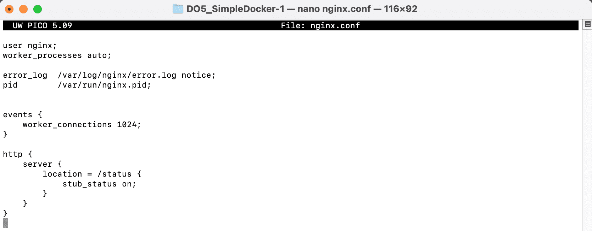

## Готовый докер

Загрузка образа nginx через команду `docker pull`

Проверка наличия образа через команду `docker images`

Запуск образа через комнаду `docker run`

Проверка наличия процесса через команду `docker ps`

Просмотр информации о контейнере через команду \
`docker inspect %container_id%`

Размер докер образа

Его IP

Замапленый порт\
\
Остановка докер образа и проверка его остановки

Запуск образа с замапленными портами

Проверка работы сервера

Перезагрузка докер образа и проверка наличия процесса


## Операции с контейнером

Вывод содержимого файла nginx.conf


Создание файла nginx.conf и настройка в нем по пути /status отдачу страницы статуса сервера

Коприование nginx.conf внутрь докер образа, перезагрузка nginx, проверка статуса сервера

Экспорт докер контейнера в файл, остановка контейнера

Удаление докер образа и проверка того, что он удален

Удаление остановленного контейнера

Импорт сохраненного контейнера, его запуск и проверка работоспособности

Проверяем, что по адресу localhost:80/status отдается страничка со статусом сервера nginx.

Содержимое файла nginx.conf;


## Part 3. Мини веб-сервер  
* Пишем мини сервер на C и FastCgi, который будет возвращать простейшую страничку с надписью `Hello World!`  
  


* Пишем свой nginx.conf, который будет проксировать все запросы с 81 порта на 127.0.0.1:8080  
  


* Качаем образ nginx, запускаем контейнер, копируем c файл сервера и conf файл nginx  
  


* Заходим в контейнер командой `docker exec -it keiraski_server bash`, обновляем репозитории,   
  

устанавливаем gcc, spawn-fcgi и libfcgi-dev флаг `-У` для `install` означает автоматическое согласие на все запросы во время установки

  


* Компилируем и запускаем сервер  
  
  

* проверяем нашу страничку  
  

## Part4. Свой докер

* Напишем свой docker-образ, который собирает исходники 3-й части, запускает на порту `80`, после копирует внутрь написанный нами `nginx.conf` и, наконец, запускает `nginx` (ниже приведены файлы `entrypoint.sh` 

 
и `Dockerfile`, 
  
файлы `nginx.conf` и `server.c` остаются с 3-й части) 

* Соберем написанный docker-образ через команду `docker build`, при этом указав имя и тэг нашего контейнера  
  

* Теперь удостоверимся, что все собралось, проверив наличие соответствующего образа командой `docker images`  
  

* После запустим собранный docker-образ с мапингом порта `81` на порт `80` локальной машины, а также мапингом  `./nginx` внутрь контейнера по адресу конфигурационных файлов nginx'а, и проверим, что страничка написанного сервера по адресу 


```
!!Примечание!!
Если при проверке адреса localhost вы увидете ошибку 502, остановите запущенный docker-образ, после исправьте ошибки в конфигурационных файлах и заново запустите собранный docker-образ
```

* Теперь добавим в файл `nginx.conf` проксирование странички `/status`, по которой необходимо отдавать статус сервера `nginx  


* Теперь перезапустим `nginx` в своем docker-образе командой `nginx -s reload`  


* Наконец, проверим, что по адресу `localhost/status` выдается страничка со статусом сервера `nginx`  


## Part5. Dockle

```
!!Примечание!!
Перед выполнением данного шага необходимо установить утилиту [dockle], инструкция по установке [https://github.com/goodwithtech/dockle], если машина не видит утилиту [https://github.com/aquasecurity/trivy/issues/2432], также рекомендую добавить своего пользователя в группу [docker]
```

* Просканируем docker-образ из предыдущего задания на предмет наличия ошибок командой `dockle [image_id|repository]`  


Выходит ошибка которую я не смог исправить и не нашел решения поэтому нашел другой путь... Создаю Docker образ с утилитой dockle в которую помещаю для проверки мой контейнер miniserver:part4


* Далее исправим конфигурационные файлы docker-образа так, чтобы при проверке через утилиту `dockle` не возникало ошибок и предупреждений (для Part5 я создал отдельный контейнер с тэгом `part5`, куда подгрузил измененные конфиги, конфиг в nginx не удалось исправить уязвимость CIS-DI-0010 и я создал образ ubuntu в которой все уязвимости были устранены)


* Опять проверяем на наличие уязвимостей и видим что критических уязвимистей нет


## Part6. Basic Docker Compose

```
!!Примечание!!
Перед выполнением данного шага необходимо установить утилиту [docker-compose], инструкция по установке [https://www.digitalocean.com/community/tutorials/how-to-install-and-use-docker-compose-on-ubuntu-20-04]
```

* Перепишем скрипт entrypoint для второго контейнера 
  


* Перепишем _**nginx.conf**_ для проксирования  
  


* напишем **_docker-compose.yml_**  
  

* Теперь сбилдим контейнер командой `docker-compose build`
  

* После необходимо поднять сбилженный контейнер командой `docker compose up`
  

* В завершение насладимся плодами своей усердной работы, удостоверившись, что по адресу `localhost` отдается страничка с надписью `Hello World!`

  