## Part 1. Настройка gitlab-runner

Поднял виртуальную машину Ubuntu Server 22.04 LTS.
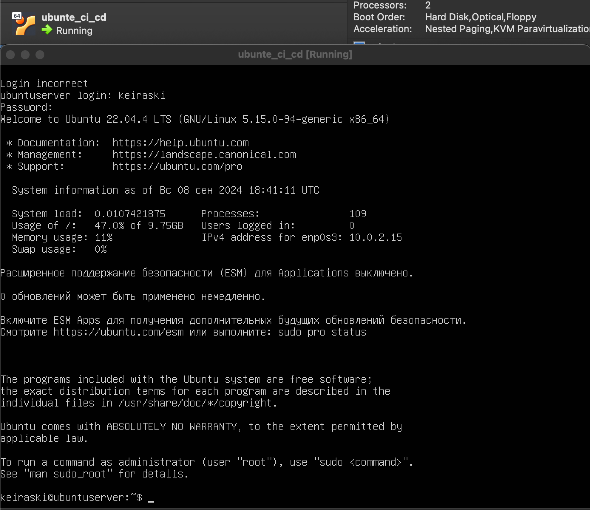 

Скачал и установил на виртуальную машину gitlab-runner.
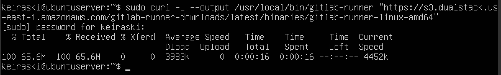 
Дал разрешение на запуск
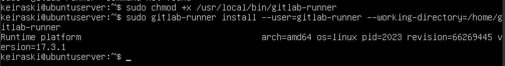 

Запустил gitlab-runner и зарегистрировал его для использования в текущем проекте (DO6_CICD).
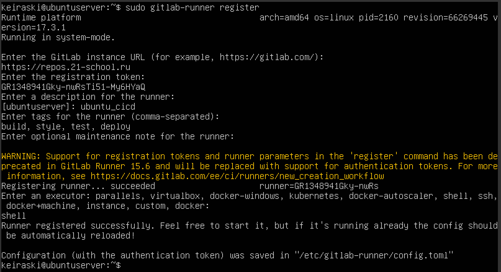

Так же необходимо установить на машину gcc make clang-format (и sshpass в моем случае)
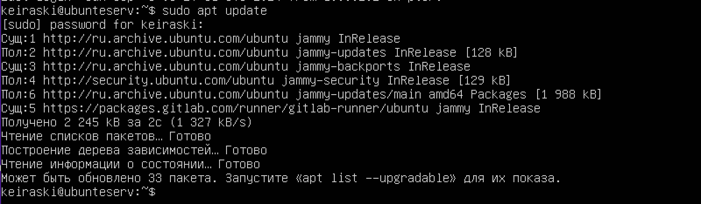

Для регистрации понадобятся URL и токен, которые можно получить на страничке задания на платформе.
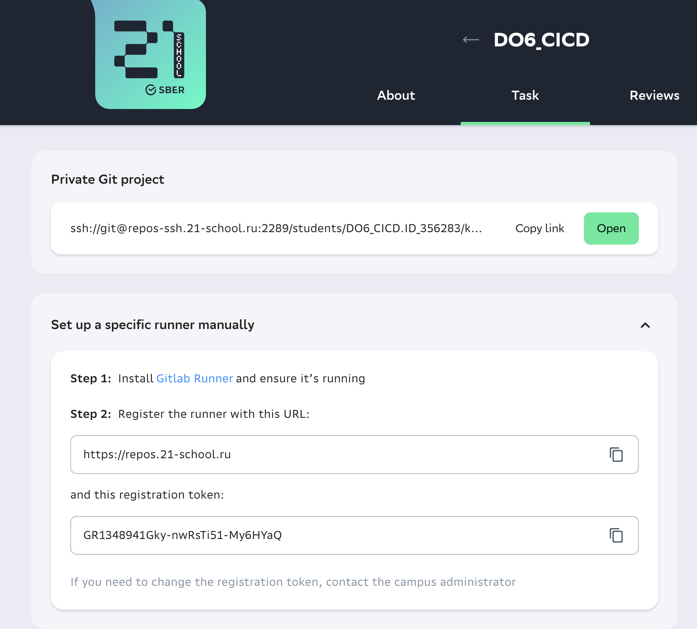

## Part 2. Сборка

Напишисал этап для CI по сборке приложений из проекта C2_SimpleBashUtils.

В файле gitlab-ci.yml добавила этап запуска сборки через мейк файл из проекта C2.
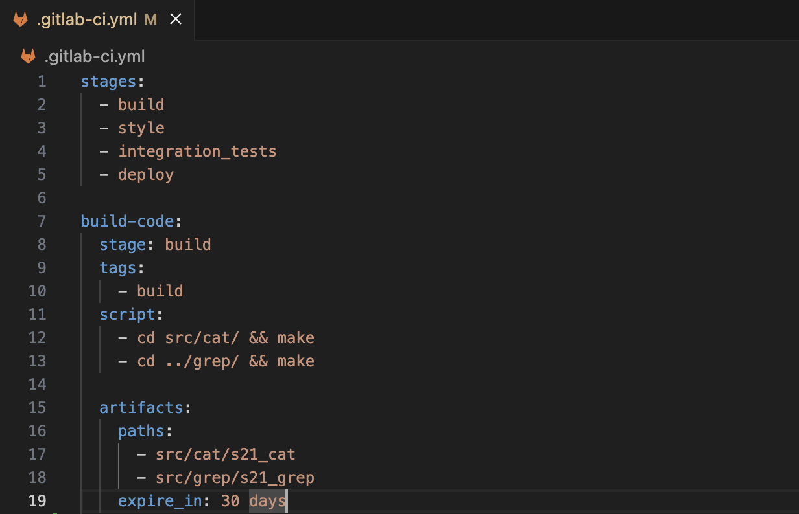
Файлы, полученные после сборки (артефакты), сохранил в произвольную директорию со сроком хранения 30 дней.

Запушил проект Pipeline запустился автоматически 
 

В случае неуспешного запуска открыть файл /home/gitlab-runner/.bash_logout

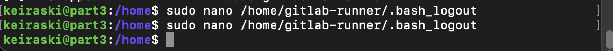 
и закоментировать условие
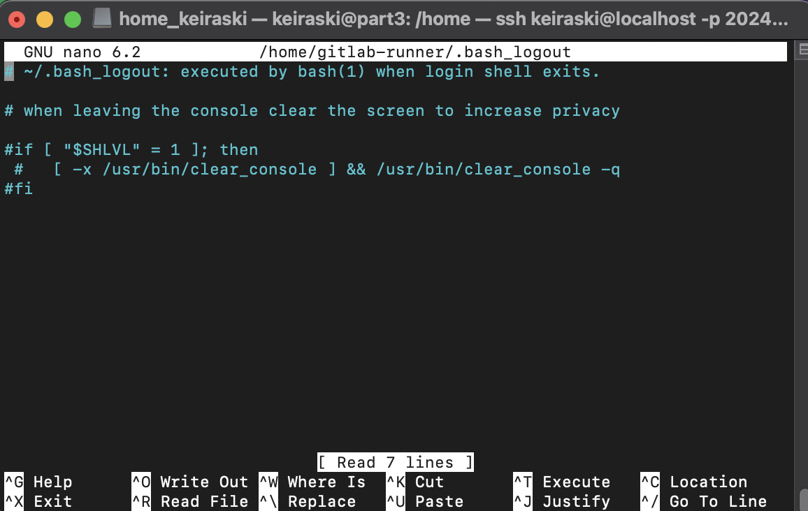 

после этого должно заработать

 

## Part 3. Тест кодстайла

Напишисал этап для CI, который запускает скрипт кодстайла (clang-format).

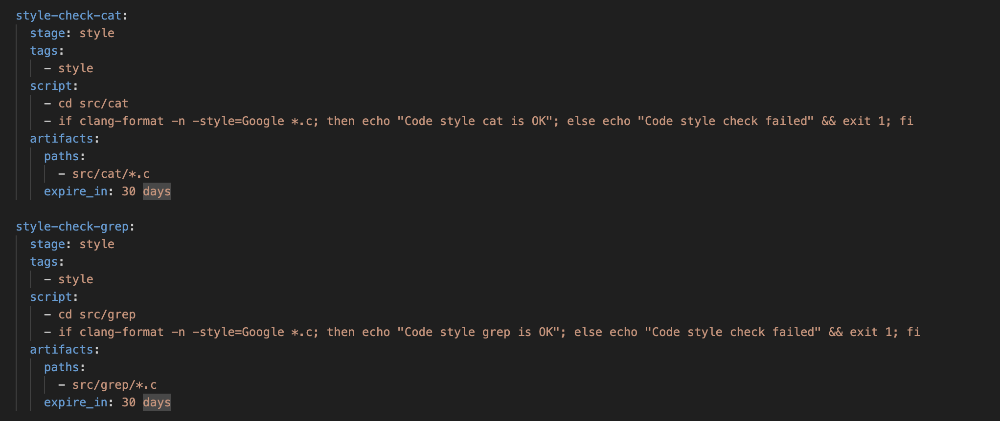 

Pipeline запустился и отработал без ошибок
 

## Part 4. Интеграционные тесты

Написал этап для CI, который запускает  интеграционные тесты из того же проекта.
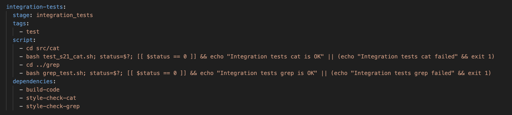
Условия запуска этого этапа стоят автоматически только при условии, если сборка и тест кодстайла прошли успешно.

dependencies:
- build-code
- style-check-cat
- style-check-grep

Если тесты не прошли, то «зафейли» пайплайн.
В пайплайне отобразила вывод, что интеграционные тесты успешно прошли / провалились.

## Part 5. Этап деплоя

Поднял вторую виртуальную машину Ubuntu Server 22.04 LTS.
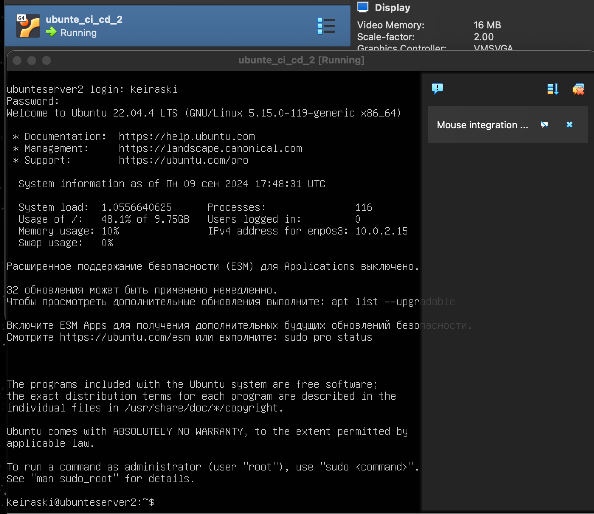
Настроил сеть между машинами
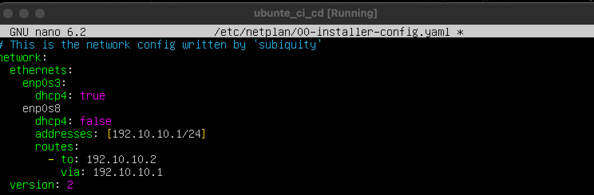
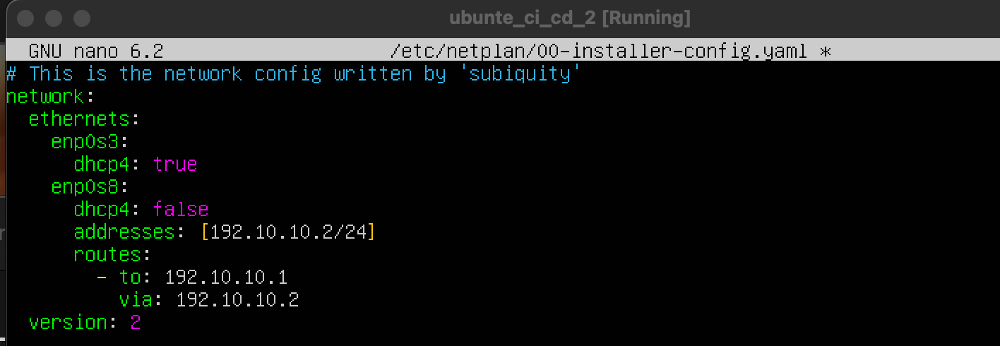
Машины пингуются между собой
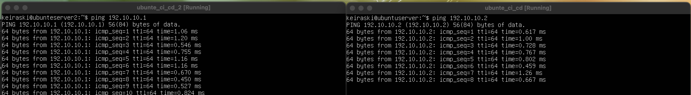
Написал этап для CD, который «разворачивает» проект на другой виртуальной машине.
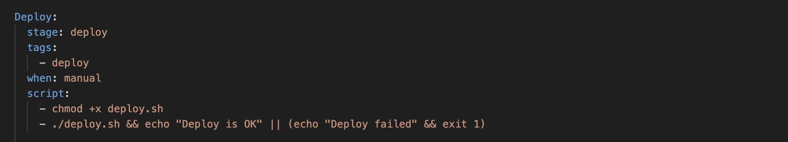

Запустил этот этап вручную при условии, что все предыдущие этапы прошли успешно.
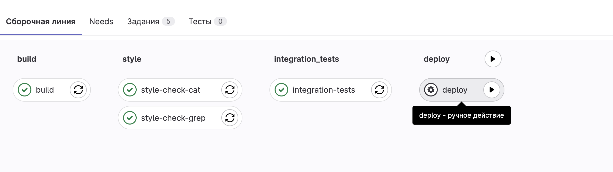

Напишисал bash-скрипт, который при помощи ssh и scp копирует файлы, полученные после сборки (артефакты), в директорию /usr/local/bin второй виртуальной машины.

В файле gitlab-ci.yml добавил этап запуска написанного скрипта.
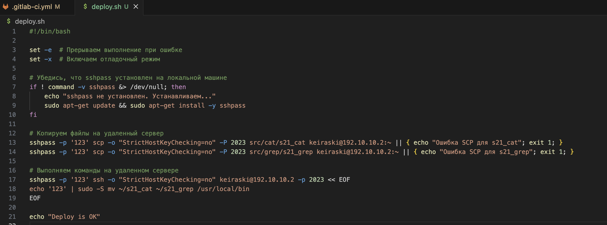

Этап деплоя запущенный вручную выполнился без ошибок

Проверяем выполнение и видим, что исполняемые файлы сохранены на второй машине.
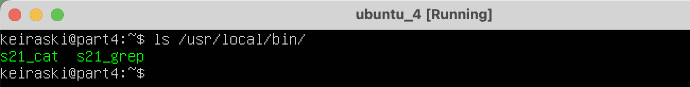

Сохранил образы
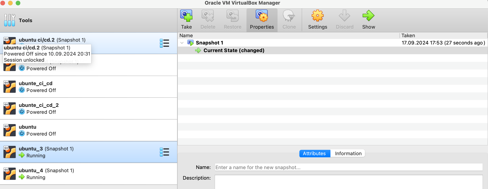

## Part 6. Дополнительно. Уведомления

Написал bash скрипт для отправки уведомлений в телеграм бот об успешном/неуспешном выполнении пайплайна.
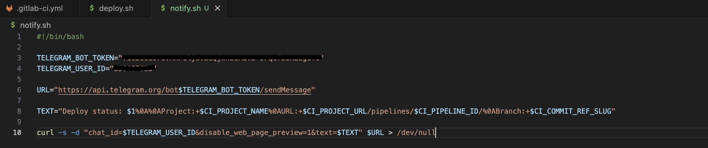

Настроил yml файл чтобы после каждого этапа отправлялось уведомление в телегармм.
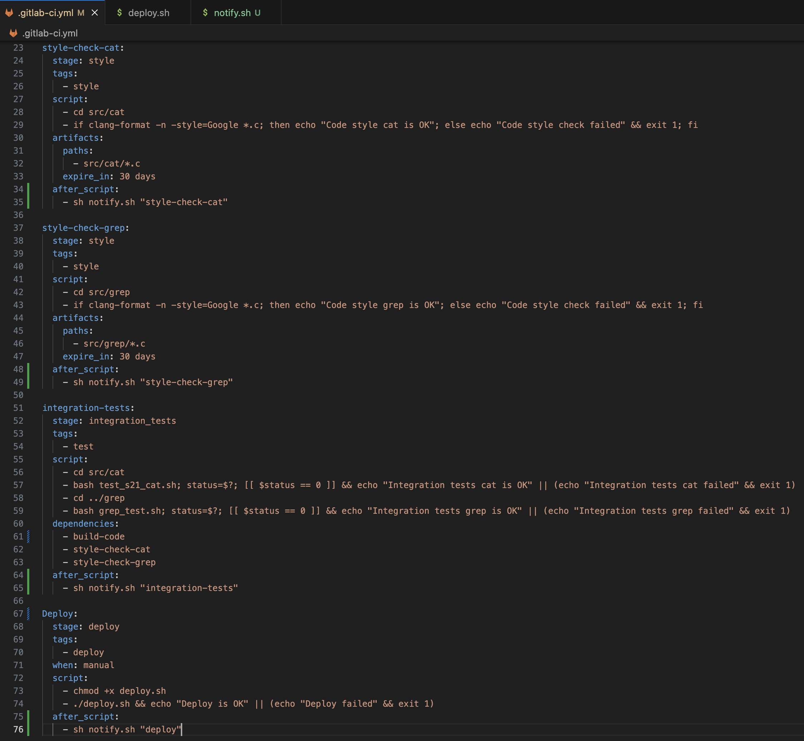

Успешная работа телеграмм бота
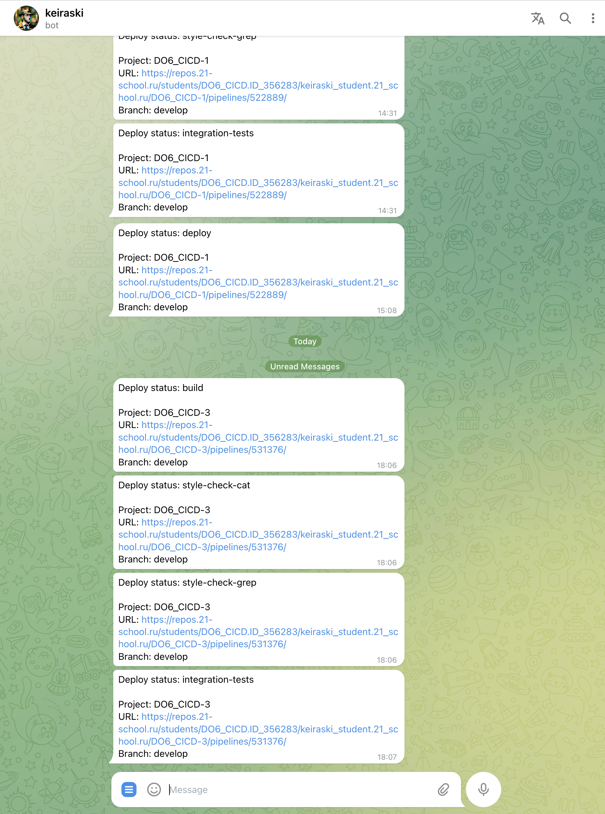